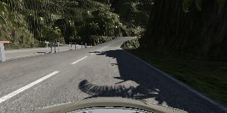
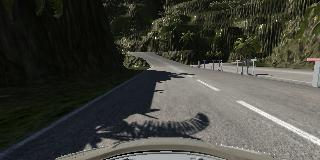

# Behavorial Cloning

The goal of this project is to predict the steering angles from the center camera images of the car.

## Steps of the Project:
* Use the simulator to generate Images(Center, Left and Right) Vs (Steering, Throttle, Brake And Speed).
* Perform some basic Pre-Processing.
* Build a model that predict's the steering angle by taking the image as the input.
* Train and Validate the model to see to that the model fits the data properly.
* After training the model should drive autonomusly around the track without leaving the road.

## Rubic Points
***
#### Required Files:
**Are all required files submitted?:** 
The submission includes all the required files:
* model.py
* drive.py
* model.h5
* track1.mp4
* track2.mp4

***
#### Quality of Code:
**Is the code functional?:**
The vehicle can driven autonomusly around the track using the command :
```sh
python drive.py model.h5
```
And then the simulator can be opened and then tested around Track 1 and Track 2.

**Is the code usable and readable?:** 
The model can be trained using the command:
```sh
python model.py
```
And then the model can be evluated using the command:
```sh
python drive.py model.h5
```
***
#### Model Architecture and Training Stratergy:
**Has an appropriate model architecture been employed for the task?:**
The model I used contains 3 Convolution Layers of Filter Size: 5x5 and Stride: 2x2 ,2 Convolution Layers of Filter Szie: 3x3 and Stride: 2x2. After the convolution layers there are 4 Fully Connected Layers with dropout in between them.


**Has an attempt been made to reduce overfitting of the model?**
The model incorporates dropout in the fully connected layers and normalization [before feeding the image into the  Convolution Neural Network] in order to reduce overfitting. And also the data has been split into Training and Validation set in order to check that the model genralizes the data and dose not overfit or underfit.


**Have the model parameters been tuned appropriately?** 
Yes, The model parameters have been tuned appropritely so that the model genralizes well on the dataset and dosent overfir or underfit.

**Is the training data chosen appropriately?** 
Yes, the training data has been chosen appropriately in order for the model to drive only on the road.

***
#### Architecture and Training Documentation

**Solution Design Approach:**

* I used the Convolution Neural Network similar to Nvidia's [End to End Learning for Self-Driving Cars](https://arxiv.org/abs/1604.07316) Network. The only main difference is that the model used has incorporated dropout between the fully connected layer's. 
* Without dropout the model overfits the training data producing a much larger error in Validation set than in training set.
* Traning - Validation split was kept at 80% - 20%.
* Training only on the data form Track 1 did not genralize well around sharp turns as most of the track contains smooth curves.
* Training it on Track 2 and then introducing data from Track 1 made the model genralize much better for both the tracks.

**Final Model Architecture:**

Model Architecture:

| Layer        | Description           |
| -------------|:--------------------:|
| Input        | 160 x 320 x 3 RGB |
| Normalization | (X / 255.0) - 0.5 |
| Cropping | Top 70, Bottom 25, Pixels are Cropped, output: 65 x 320 x 3 |
| 5x5 Convolution, 24 layers | 2x2 stride, same padding, output: 33 x 160 x 24|
| ReLU | Applying Rectified Linear Unit as Activation |
| 5x5 Convolution, 36 layers| 2x2 stride, same padding, output:17 x 80 x 36|
| ReLU | Applying Rectified Linear Unit as Activation |
| 5x5 Convolution, 48 layers| 2x2 stride, same padding, output:9 x 40 x 48|
| ReLU | Applying Rectified Linear Unit as Activation |
| 3x3 Convolution, 64 layers| 2x2 stride, same padding, output:5 x 20 x 64|
| ReLU | Applying Rectified Linear Unit as Activation |
| 3x3 Convolution, 64 layers| 2x2 stride, same padding, output:3 x 10 x 64|
| ReLU | Applying Rectified Linear Unit as Activation |
| Flatten | Flatten:1920 (3 x 10 x 64) |
| Dropout | Dropout is applied with a keep_probability = 0.5 |
| Fully Connected 1 | 1920 fully connected to 1164 |
| Dropout | Dropout is applied with a keep_probablility = 0.5 |
| Fully Connected 2 | 1164 fully connected to 100 |
| Dropout | Dropout is applied with a keep_probablility = 0.5 |
| Fully Connected 3 | 100 fully connected to 50 |
| Dropout | Dropout is applied with a keep_probability = 0.6 |
| Fully Connected 4 | 100 fully connected to 1 [Output] |


**Creation of Training Set and Training Process:**

* First I collected data from Track 2. [Three laps normally and one lap in the reverse direction]
* And then used Track 1 to collect data. [Three laps normally and then one lap in the reverse direction]


This resulted in a total of 1,00,176 images.

* While training the images were flipped and added to the original dataset in order to create additional training images.
* The dataset was shuffled before splitting into Training and Validation sets.
* The dataset is split into 80% Training and 20% Validation.
* Before feeding the images into the network the images are normalized.


* __Loss Function__ : Mean Squared Error.
* __Optimizer__ : Adam
* __Learning Rate__ : 0.001 (With Reduce Learning Rate on Platue with a factor of 0.1)
* __Epoch__ : 5
* __Batch Size__ : 30

__Original Image:__



__Flipped Image:__



__Normalized Image:__


***
